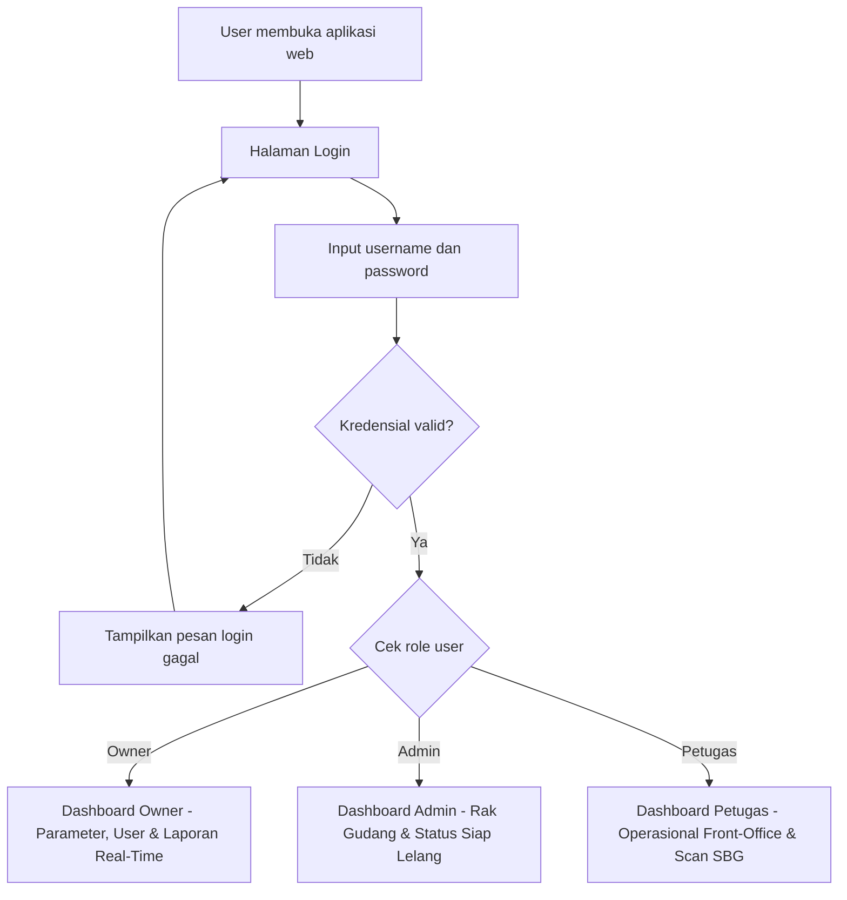
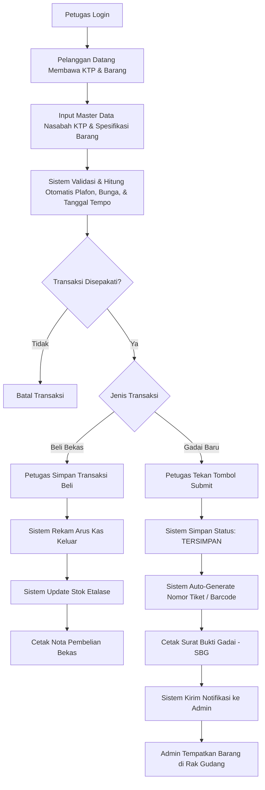
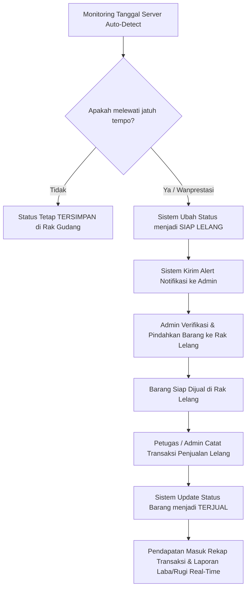
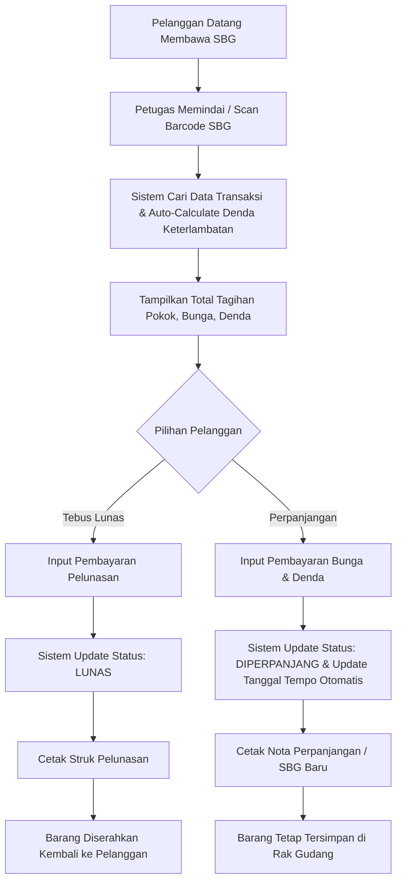
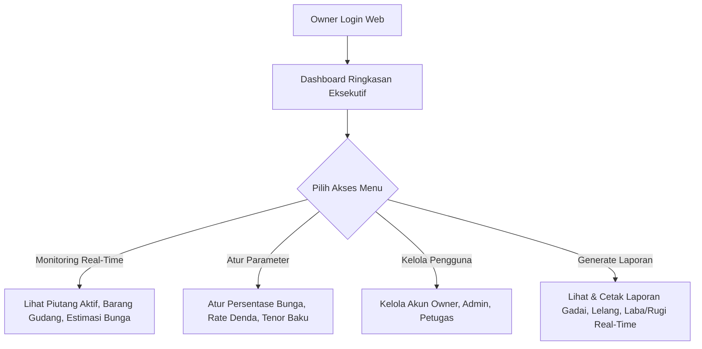
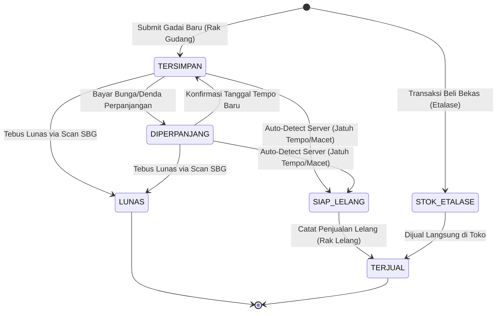

# Flow — Alur Sistem Informasi Manajemen Operasional Penggadaian
### Konter Buulolo Cell99

Dokumen ini menjelaskan alur sistem berdasarkan **role pengguna** (Petugas, Admin, Owner), **otomasi sistem**, dan pemetaan kebutuhan fungsional (FR-1.1 s/d FR-3.4) sesuai [prd.md](file:///c:/Users/rendani/Documents/JOKI/REG%20B/Fikarlin-001/sistem-penggadaian/docs/prd.md).

---

## 1. Kesimpulan Alur Sistem Usulan

Alur sistem dirancang untuk memberikan efisiensi operasional dengan pembagian tugas yang jelas:

- **Petugas (Front-Office / Kasir)**: Mengelola master nasabah (FR-1.1), transaksi gadai baru dengan auto-calculate & cetak SBG (FR-1.2, FR-1.5), pelunasan, denda & perpanjangan (FR-1.3), transaksi beli barang bekas (FR-1.4), serta modul penjualan lelang (FR-2.4).
- **Admin (Gudang & Pengelola Operasional)**: Kelola stok & lokasi rak gudang (FR-2.1), pantau jatuh tempo (FR-2.2), ubah/verifikasi status barang macet → `SIAP LELANG` (FR-2.3), serta verifikasi fisik rak lelang.
- **Monitoring Server (Auto-Detect)**: Otomasi tanggal server yang mendeteksi jatuh tempo dan memperbarui status barang wanprestasi menjadi `SIAP LELANG`.
- **Owner (Pemilik / Pengawas)**: Dashboard eksekutif (FR-3.1), atur parameter sistem bunga, denda, tenor (FR-3.2), kelola akun pengguna (FR-3.3), serta lihat & cetak laporan laba/rugi real-time (FR-3.4).

---

## 2. Alur Login & Routing Berdasarkan Role

---

## 3. Flow Petugas — Input Transaksi Awal & Percabangan Alur (FR-1.1 - FR-1.5)

Petugas melayani pelanggan yang datang membawa KTP dan barang jaminan/jual.

---

## 4. Flow Auto-Detect Server & Penanganan Barang Lelang (FR-2.2 - FR-2.4)

Monitoring otomatis berbasis tanggal server berjalan secara kontinu untuk mendeteksi jatuh tempo.

---

## 5. Flow Pelanggan Datang Membayar (FR-1.3)

Ketika pelanggan datang membawa Surat Bukti Gadai (SBG) untuk pelunasan atau perpanjangan.

---

## 6. Flow Role Owner — Parameter & Laporan Terpusat (FR-3.1 - FR-3.4)

Owner dapat langsung mengakses web untuk mengatur parameter, mengelola akun, dan men-generate laporan.

---

## 7. Definisi Status Barang Jaminan (State Machine)

Matriks Status Barang:

| Status | Deskripsi | Pemicu Perubahan |
|---|---|---|
| `TERSIMPAN` | Barang gadai baru telah diregistrasi dan ditempatkan di gudang | Petugas submit transaksi gadai baru |
| `DIPERPANJANG` | Tanggal jatuh tempo diperbarui setelah pembayaran bunga/denda perpanjangan | Petugas proses opsi perpanjangan |
| `LUNAS` | Barang telah ditebus penuh oleh nasabah | Petugas proses tebus lunas |
| `SIAP LELANG` | Barang wanprestasi/macet, menunggu verifikasi pemindahan ke rak lelang | Sistem auto-detect jatuh tempo terlampaui |
| `TERJUAL` | Barang lelang telah terjual ke pembeli | Petugas / Admin catat penjualan lelang |

---

## 8. Matriks Hak Akses Kebutuhan Fungsional (RBAC)

| Kode FR | Kebutuhan Fungsional | Petugas | Admin | Owner |
|---|---|:---:|:---:|:---:|
| **FR-1.1** | Input & kelola master data nasabah | **Ya** | - | - |
| **FR-1.2** | Catat transaksi gadai baru (taksiran, plafon, tenor) | **Ya** | - | - |
| **FR-1.3** | Catat perpanjangan, denda, & pelunasan gadai | **Ya** | - | - |
| **FR-1.4** | Catat transaksi beli barang bekas | **Ya** | - | - |
| **FR-1.5** | Cetak SBG, kuitansi pelunasan, & nota pembelian | **Ya** | - | - |
| **FR-2.1** | Kelola stok & lokasi rak gudang | - | **Ya** | - |
| **FR-2.2** | Pantau daftar kontrak mendekati & lewat jatuh tempo | - | **Ya** | - |
| **FR-2.3** | Ubah status barang macet → siap jual/lelang | - | **Ya** | - |
| **FR-2.4** | Catat transaksi penjualan barang lelang | **Ya** | **Ya** | - |
| **FR-3.1** | Dashboard eksekutif (piutang, stok, bunga) | - | - | **Ya** |
| **FR-3.2** | Atur parameter sistem (bunga, denda, tenor) | - | - | **Ya** |
| **FR-3.3** | Kelola akun pengguna sistem | - | - | **Ya** |
| **FR-3.4** | Lihat & cetak laporan transaksi, lelang, laba/rugi | - | - | **Ya** |
