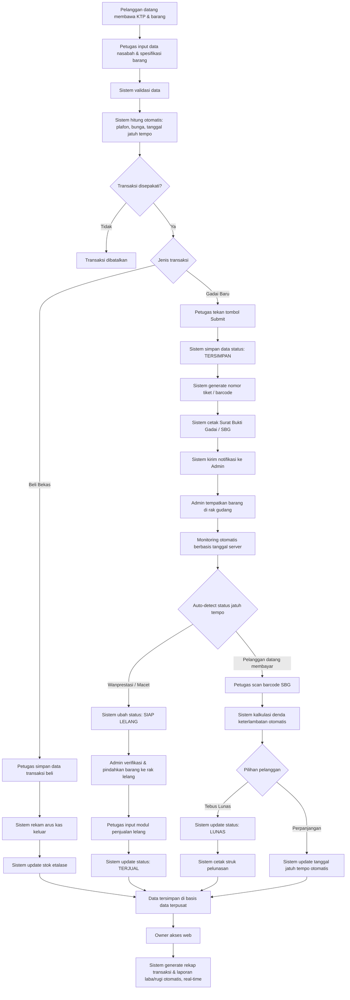

# PRD — Sistem Informasi Manajemen Operasional Penggadaian
## Konter Buulolo Cell99

| | |
|---|---|
| **Dokumen** | Product Requirements Document (PRD) |
| **Produk** | SIM Operasional Penggadaian Berbasis Web |
| **Metode Pengembangan** | Rapid Application Development (RAD) |
| **Versi** | 1.0 |
| **Status** | Draft untuk Perancangan Sistem |

---

## 1. Latar Belakang

Konter Buulolo Cell99 menjalankan dua lini bisnis sekaligus: jasa gadai barang elektronik dan jual-beli barang elektronik bekas. Saat ini kedua proses masih dicatat secara konvensional (buku register/arsip terpisah), sehingga menimbulkan empat kendala utama:

1. **Pencatatan konvensional & terpisah** — rawan human error dan duplikasi data.
2. **Kesalahan perhitungan manual** — bunga, denda, dan taksiran dihitung manual oleh petugas.
3. **Pemantauan status barang tidak terpusat** — status barang jaminan (gudang, diperpanjang, ditebus, jatuh tempo, lelang) tidak dapat dilacak real-time.
4. **Keterlambatan rekapitulasi laporan** — laporan harian/bulanan dan laba/rugi memakan waktu lama karena nota masih fisik.

Dokumen ini merumuskan kebutuhan produk untuk sistem usulan yang mengotomatisasi seluruh proses tersebut dalam satu basis data terpusat, berbasis web.

---

## 2. Tujuan Produk

1. Mengintegrasikan pencatatan transaksi gadai dan jual-beli barang bekas dalam satu sistem terpusat.
2. Menghasilkan aplikasi yang sesuai kebutuhan operasional secara cepat, akurat, dan adaptif melalui pendekatan RAD dengan keterlibatan aktif pemilik usaha.
3. Mengotomatisasi perhitungan nilai taksiran, plafon pinjaman, bunga, dan denda keterlambatan untuk meminimalkan *calculation error*.
4. Menyediakan pengelolaan status inventaris barang jaminan secara real-time serta laporan keuangan (harian, bulanan, laba/rugi) yang cepat dan efisien bagi Owner dan pengelola.

---

## 3. Target Pengguna & Peran (Role-Based Access Control)

| Role | Cakupan Tanggung Jawab |
|---|---|
| **Petugas** (Front-Office/Kasir) | Input data nasabah, transaksi gadai baru, perpanjangan, pelunasan, pembelian barang bekas, cetak SBG/kuitansi/nota |
| **Admin** (Gudang & Pengelola Operasional) | Kelola stok & lokasi rak gudang, monitoring jatuh tempo, ubah status barang macet → siap lelang, catat penjualan lelang |
| **Owner** (Pemilik/Pengawas) | Dashboard eksekutif, atur parameter sistem (bunga, denda, tenor), kelola akun pengguna, akses & cetak laporan |

---

## 4. Kebutuhan Fungsional per Role

### 4.1 Role Petugas (Front-Office / Kasir)
- **FR-1.1**: Input dan kelola master data nasabah/pelanggan.
- **FR-1.2**: Catat transaksi gadai baru (spesifikasi barang, taksiran, tenor, pencairan pinjaman).
- **FR-1.3**: Catat transaksi perpanjangan bunga, pembayaran denda, dan pelunasan gadai.
- **FR-1.4**: Catat transaksi pembelian barang elektronik bekas dari nasabah.
- **FR-1.5**: Cetak Surat Bukti Gadai (SBG), kuitansi pelunasan, dan nota pembelian.

### 4.2 Role Admin (Gudang & Pengelola Operasional)
- **FR-2.1**: Kelola stok dan lokasi rak/posisi barang jaminan di gudang.
- **FR-2.2**: Pantau daftar kontrak gadai yang mendekati dan telah melewati jatuh tempo.
- **FR-2.3**: Ubah status barang macet/jatuh tempo menjadi status *siap jual/lelang*.
- **FR-2.4**: Catat transaksi penjualan barang lelang kepada pembeli.

### 4.3 Role Owner (Pemilik/Pengawas)
- **FR-3.1**: Akses dashboard ringkasan eksekutif (total piutang aktif, total barang di gudang, estimasi bunga masuk).
- **FR-3.2**: Atur parameter sistem (persentase bunga, rate denda, tenor baku).
- **FR-3.3**: Kelola akun pengguna sistem (Owner, Admin, Petugas).
- **FR-3.4**: Lihat dan cetak laporan transaksi gadai, laporan inventaris barang lelang, dan laporan laba/rugi periode terpilih.

---

## 5. Alur Sistem Usulan (System Flow)

### 5.1 Ringkasan Alur

Sistem usulan dimulai saat pelanggan datang membawa KTP dan barang. Petugas menginput data nasabah serta spesifikasi barang ke aplikasi web, kemudian sistem melakukan validasi dan menghitung otomatis nilai plafon, bunga, dan tanggal jatuh tempo. Setelah transaksi disepakati, alur bercabang menjadi dua jalur (**Beli Bekas** dan **Gadai Baru**), berlanjut ke tahap monitoring otomatis berbasis tanggal server, hingga akhirnya seluruh data transaksi terpusat di basis data untuk kebutuhan pelaporan Owner.

### 5.2 Diagram Alur

### 5.3 Rincian Tahapan Alur

**Tahap 1 — Registrasi & Validasi Awal**
1. Pelanggan datang membawa KTP dan barang jaminan/barang bekas.
2. Petugas menginput data nasabah dan spesifikasi barang ke aplikasi web.
3. Sistem melakukan validasi data dan menghitung secara otomatis: nilai taksiran, nilai plafon pinjaman, persentase bunga, dan tanggal jatuh tempo.

**Tahap 2 — Percabangan Jenis Transaksi**
Setelah transaksi disepakati, sistem membedakan dua jalur:

- **Jalur Beli Bekas:**
  - Petugas menyimpan data transaksi pembelian.
  - Sistem otomatis merekam arus kas keluar.
  - Sistem otomatis memperbarui stok etalase.

- **Jalur Gadai Baru:**
  - Petugas menekan tombol **Submit**.
  - Sistem menyimpan data dengan status **TERSIMPAN**.
  - Sistem men-generate nomor tiket/barcode.
  - Sistem mencetak Surat Bukti Gadai (SBG).
  - Sistem mengirim notifikasi ke Admin untuk penempatan barang di rak gudang.

**Tahap 3 — Monitoring Otomatis Berbasis Tanggal Server**
Sistem secara berkelanjutan melakukan *auto-detect* status jatuh tempo kontrak gadai, dengan dua kemungkinan cabang:

- **Wanprestasi (Macet):**
  - Sistem otomatis mengubah status menjadi **SIAP LELANG**.
  - Admin memverifikasi dan memindahkan barang secara fisik ke rak lelang.
  - Petugas menginput modul penjualan lelang.
  - Status berubah menjadi **TERJUAL**.

- **Pelanggan Datang Membayar:**
  - Petugas memindai barcode SBG.
  - Sistem mengkalkulasi denda keterlambatan secara otomatis.
  - Pelanggan memilih salah satu opsi:
    - **Tebus Lunas** → status diperbarui menjadi **LUNAS**, sistem mencetak struk.
    - **Perpanjangan** → status diperbarui menjadi **DIPERPANJANG**, sistem memperbarui tanggal jatuh tempo secara otomatis.

**Tahap 4 — Pelaporan Terpusat**
Seluruh transaksi dari berbagai modul (beli bekas, gadai baru, pelunasan, perpanjangan, lelang) tersimpan terpusat dalam satu basis data. Owner dapat mengakses aplikasi web kapan saja untuk men-generate rekap transaksi dan laporan laba/rugi secara otomatis dan real-time.

---

## 6. Definisi Status Barang Jaminan (State Machine)

| Status | Deskripsi | Pemicu Perubahan |
|---|---|---|
| `TERSIMPAN` | Barang gadai baru telah diregistrasi dan ditempatkan di gudang | Petugas submit transaksi gadai baru |
| `DIPERPANJANG` | Tanggal jatuh tempo diperbarui setelah pembayaran bunga/denda perpanjangan | Petugas proses opsi perpanjangan |
| `LUNAS` | Barang telah ditebus penuh oleh nasabah | Petugas proses tebus lunas |
| `SIAP LELANG` | Barang wanprestasi/macet, menunggu verifikasi pemindahan ke rak lelang | Sistem auto-detect jatuh tempo terlampaui |
| `TERJUAL` | Barang lelang telah terjual ke pembeli | Petugas input modul penjualan lelang |

---

## 7. Kebutuhan Non-Fungsional

| Kategori | Kebutuhan |
|---|---|
| **Akurasi Perhitungan** | Perhitungan taksiran, plafon, bunga, dan denda harus konsisten dengan parameter yang diatur Owner, tanpa intervensi manual |
| **Real-time Monitoring** | Perubahan status jatuh tempo dan lelang harus terdeteksi otomatis berbasis tanggal server, tanpa proses batch manual |
| **Ketertelusuran (Traceability)** | Setiap transaksi memiliki nomor tiket/barcode unik yang dapat dipindai untuk menarik riwayat lengkap |
| **Keamanan Akses** | Implementasi RBAC (Petugas, Admin, Owner) dengan hak akses berbeda sesuai modul |
| **Ketersediaan Laporan** | Laporan transaksi, inventaris, dan laba/rugi dapat digenerate real-time tanpa rekapitulasi manual |
| **Cetak Dokumen** | Sistem mendukung pencetakan SBG, kuitansi, struk pelunasan, dan nota pembelian |
| **Notifikasi Antar Role** | Sistem mengirim notifikasi otomatis antar role (contoh: Petugas → Admin saat barang baru masuk gudang) |

---

## 8. Parameter Sistem yang Dapat Dikonfigurasi Owner

- Persentase bunga gadai
- Rate/tarif denda keterlambatan (per hari/periode)
- Tenor baku (durasi jatuh tempo default)
- Manajemen akun pengguna dan hak akses

---

## 9. Kriteria Keberhasilan (Success Metrics)

1. Seluruh transaksi gadai dan jual-beli tercatat dalam satu sistem terpusat (0% pencatatan manual paralel).
2. Perhitungan bunga, denda, dan taksiran dilakukan otomatis oleh sistem (0% kalkulasi manual oleh petugas).
3. Status barang jaminan dapat dipantau real-time oleh Admin dan Owner tanpa pengecekan fisik ke gudang.
4. Laporan harian, bulanan, dan laba/rugi dapat digenerate oleh Owner kapan saja tanpa menunggu rekapitulasi nota fisik.

---

## 10. Ruang Lingkup Metode Pengembangan

Sistem dikembangkan menggunakan metode **Rapid Application Development (RAD)**, dengan keterlibatan aktif pemilik usaha (Owner) pada setiap iterasi untuk memastikan kesesuaian fitur dengan kebutuhan operasional riil di lapangan.

